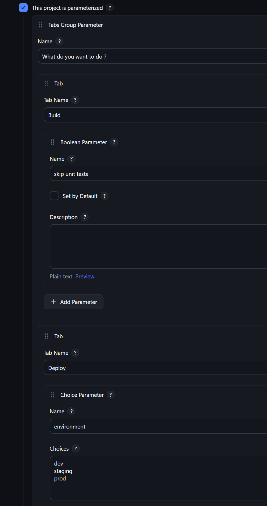
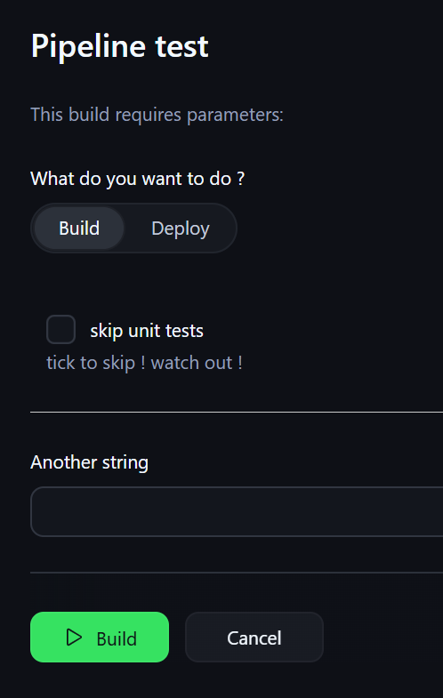
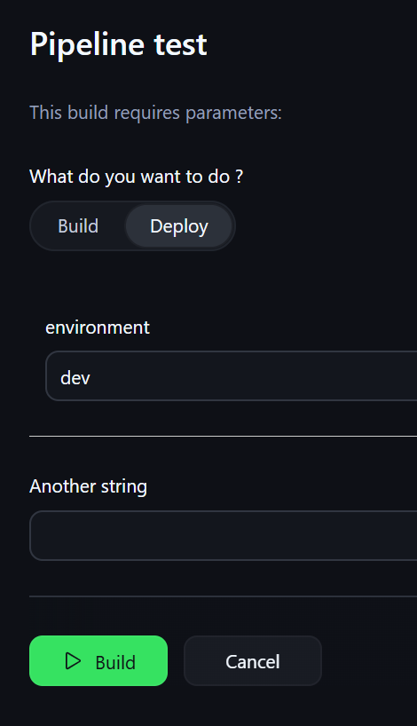

# tabs-parameter-plugin

## Introduction

This plugin provides Tabs in the "Build with parameters" view.
The style try to match to Jenkins style.
The implementation uses only base Jenkins classes and native and simple HTML/CSS/JS.

Example of build configuration :


Example of "build with parameters" view:
First tab:


Second tab:


Heavily inspired by uno choice plugin.

## Getting started

Install the plugin on your Jenkins instance. 
Add a "Tabs parameter" as you would add any other [build parameter](https://plugins.jenkins.io/build-with-parameters/)

Then you can access your parameters as usual as `params.tabGroupName.tabName.paramName` in your pipeline or freestyle job.
You can also access the selected tab as `params.tabGroupName.selectedTab`.

The layout of the parameter is defined like : 

```
params
└── tabGroupName
    ├── selectedTab <= This is the name of the selected tab
    ├── tabName1
    │   ├── paramName1
    │   └── paramName2
    └── tabName2
        ├── paramName3
        └── paramName4
```

## Limitations:

* Did not test recursion of tabs
* Not tested compatibility with rebuild plugin
* Only tested with base Jenkins Parameters
* Cannot do CLI/POST requests (TabsGroupParameterDefinition#createValue(String) is not implemented)
* All parameters are passed to the build, even the ones not visible

## Technical Infos

At first, I tough I needed to reimplement the way the parameters where rendered, which lead me to Jenkins core
territory, something that I don't wanted to try.
Now I think my implementation is not _that_ hacky.

## Issues

Lookup the GitHub Issues tab

## Contributing

See [CONTRIBUTING](https://github.com/jenkinsci/.github/blob/master/CONTRIBUTING.md)

Refer to our [contribution guidelines](https://github.com/jenkinsci/.github/blob/master/CONTRIBUTING.md)

## LICENSE

Licensed under MIT, see [LICENSE](LICENSE.md)

